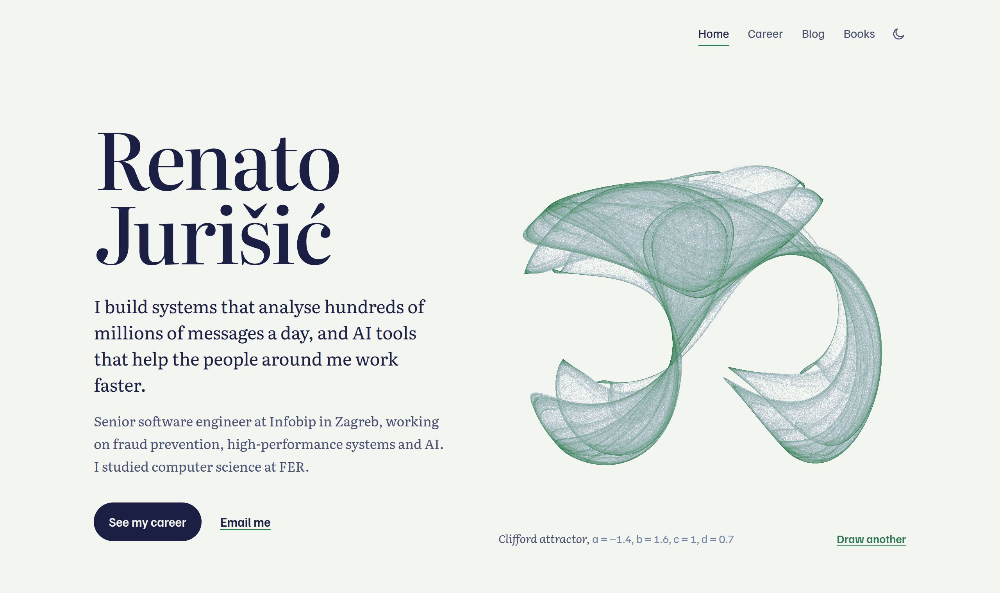

# rjurisic-website

My personal website: **https://renato555.github.io/rjurisic-website/**

I'm a senior software engineer at Infobip in Zagreb, working on fraud prevention, high-performance systems and AI. This site is where I keep my career, writing and reading in one place.

- **Home**: a short introduction. The picture next to it is a strange attractor, drawn live from millions of points. "Draw another" cycles through Clifford, Lorenz, de Jong, Rössler, Aizawa and Hénon attractors.
- **Career**: what I've built at Infobip, teaching at FER, and my studies, back to high school.
- **Blog**: writing about the problems I work on. The first posts are on the way.
- **Books**: the books I've read in my free time.

The site is plain HTML, CSS and JavaScript, with no framework, and has a light and a dark theme.
